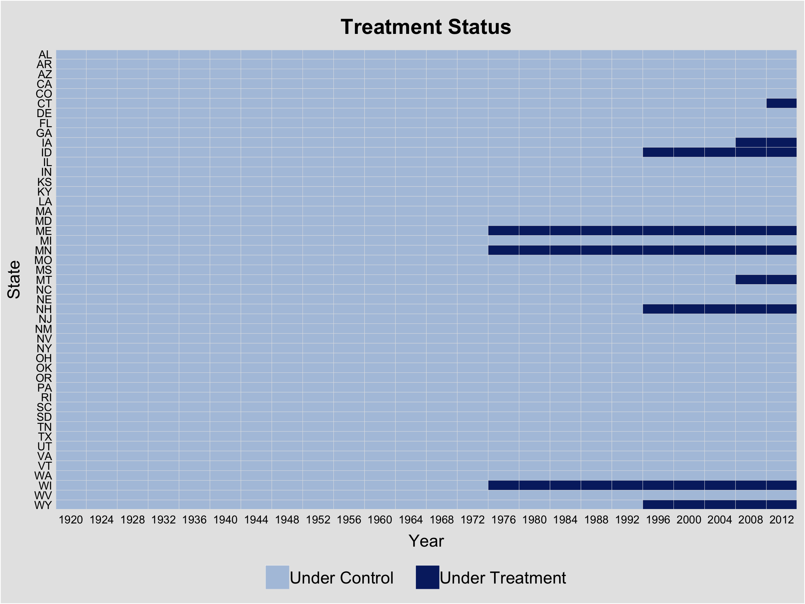
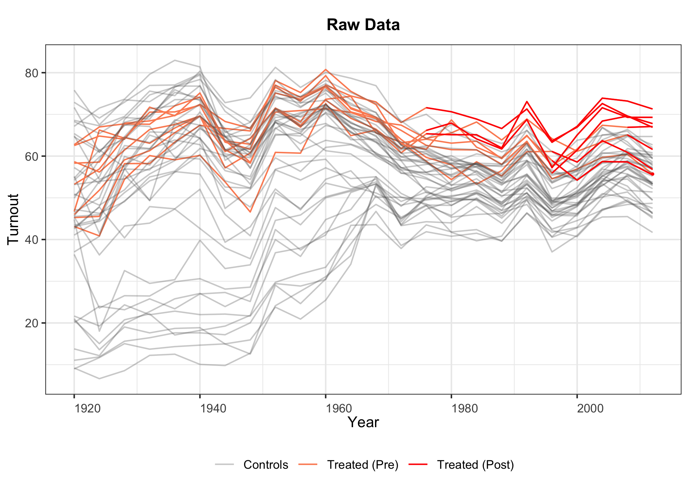
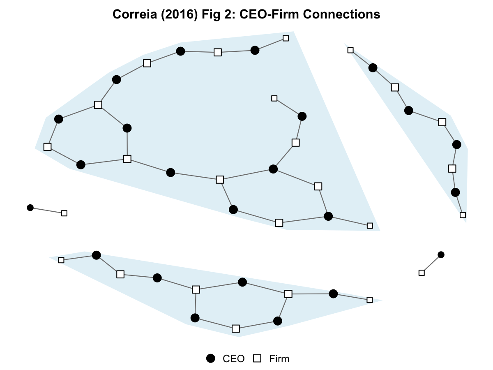
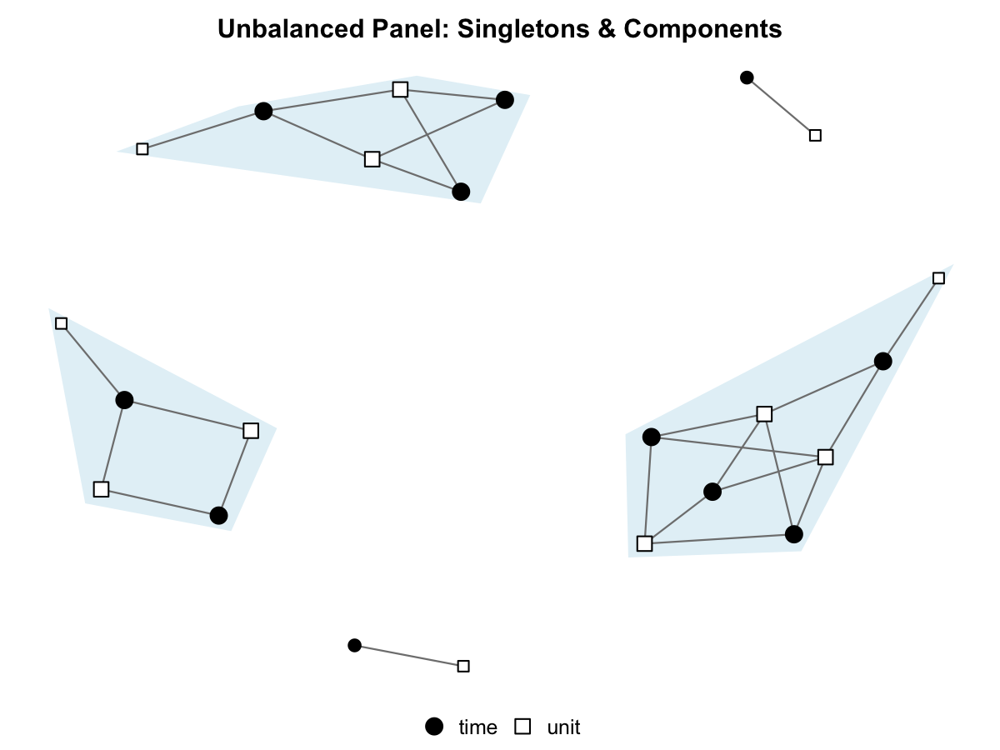
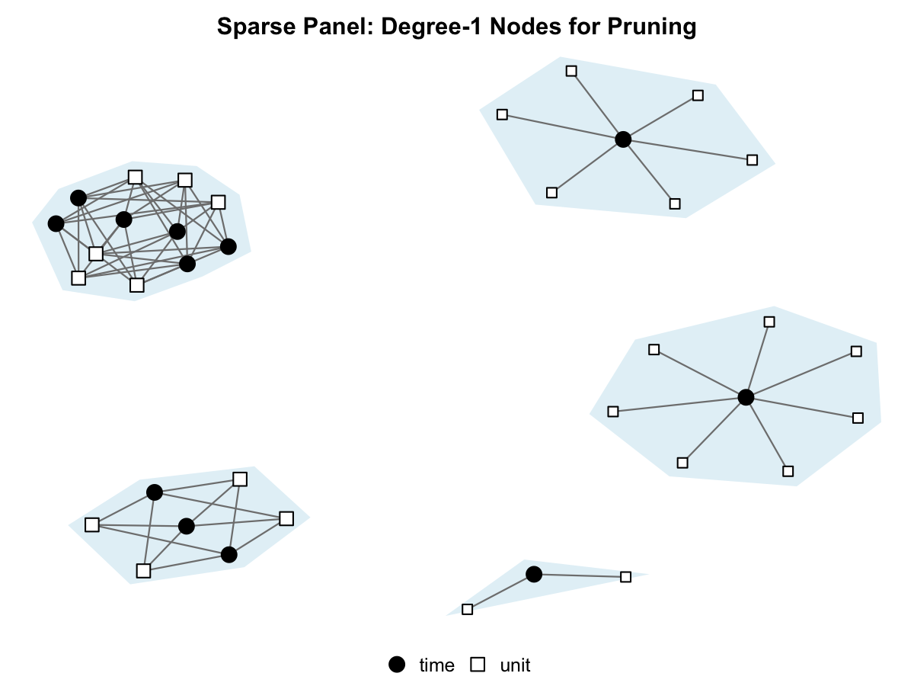
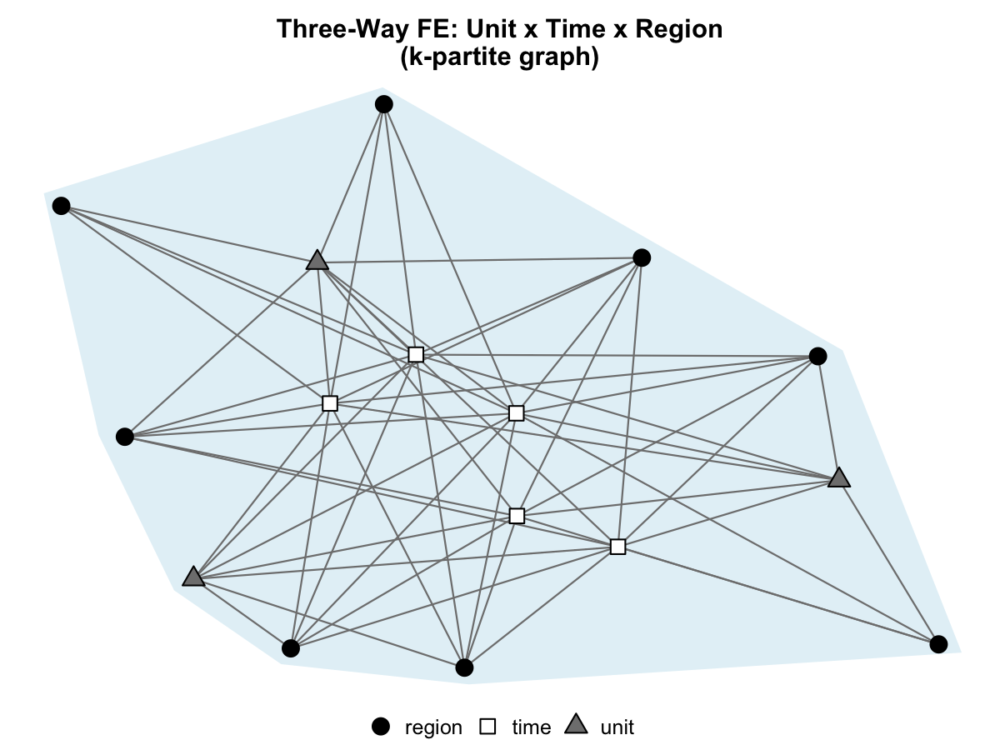
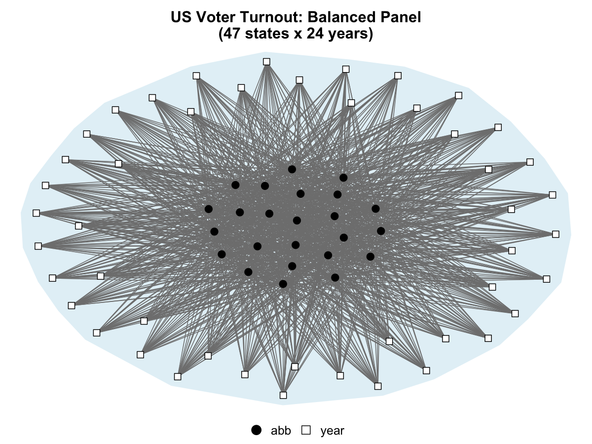
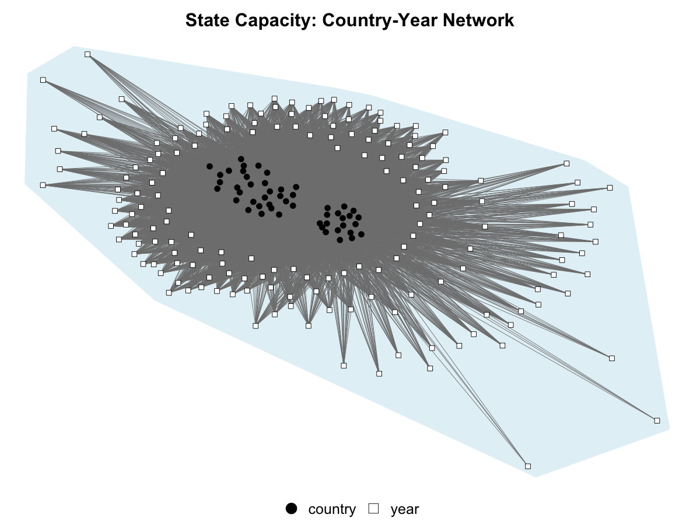

<!-- README.md is generated from README.Rmd. Please edit that file -->

# panelView

<!-- badges: start -->

[](https://www.tidyverse.org/lifecycle/#stablel)
[](https://opensource.org/licenses/MIT)
[](https://www.datasciencemeta.com/rpackages)
<!-- badges: end -->

**Authors:** Hongyu Mou (UCLA); [Licheng Liu](https://liulch.github.io/)
(MIT); [Yiqing Xu](https://yiqingxu.org/) (Stanford)

**Date:** June 17, 2024

**Repos:** [Github](https://github.com/xuyiqing/panelView) (1.1.18)
[CRAN](https://cran.r-project.org/web/packages/panelView/index.html)
(1.1.18)

**Examples:** R code used in the tutorial can be downloaded from
[here](https://github.com/xuyiqing/panelView/blob/master/examples.R).

------------------------------------------------------------------------

## Description

**panelView** visualizes panel data. It has four main functionalities:

1.  it plots treatment status and missing values in a panel dataset;
2.  it plots the temporal dynamics of an outcome variable (or any
    variable) in a panel dataset;
3.  it visualizes bivariate relationships of two variables by unit or in
    aggregate;
4.  **NEW:** it visualizes the network structure of panel data as a
    bipartite graph, identifying singletons and connected components
    (inspired by [Correia 2016](https://scorreia.com/research/hdfe.pdf)).

### Example Output

| Treatment Status | Outcome Dynamics |
|:---:|:---:|
|  |  |

*U.S. voter registration policies (turnout data). Left: treatment adoption pattern across states. Right: turnout dynamics over time.*

### Network Visualization (NEW)

Visualize the bipartite graph structure of your panel's observation matrix. Units and time periods become differently shaped nodes (filled circles vs hollow squares); edges represent observations. Light blue hulls wrap connected components. Singletons (degree-1 nodes) appear as smaller peripheral nodes — these cannot contribute to fixed-effects identification ([Correia 2016](https://scorreia.com/research/hdfe.pdf), Section 3.4).

<table>
<tr>
<td align="center" width="33%"><b>CEO-Firm Network</b><br></td>
<td align="center" width="33%"><b>Singletons & Components</b><br></td>
<td align="center" width="33%"><b>Sparse Panel</b><br></td>
</tr>
<tr>
<td align="center" width="33%"><b>k-partite (3-way FE)</b><br></td>
<td align="center" width="33%"><b>Balanced Panel</b><br></td>
<td align="center" width="33%"><b>Large Panel</b><br></td>
</tr>
</table>

``` r
library(panelView)

# Basic bipartite network (unit × time)
panelview(turnout ~ policy_edr, data = turnout,
          index = c("abb", "year"), type = "network")

# k-partite (unit × time × region)
panelview(data = mydata, index = c("unit", "time"),
          fe = "region", type = "network")

# Returns igraph object, singletons, and component info
result <- panelview(data = mydata, index = c("unit", "time"),
                    type = "network")
result$singletons   # data.frame of degree-1 nodes
result$components   # connected component sizes
result$graph        # igraph object for further analysis
```

Requires `igraph` (in Suggests — install with `install.packages("igraph")`).

## Installation

You can install the up-to-date development version from GitHub:

``` r
# if not already installed
install.packages('devtools', repos = 'http://cran.us.r-project.org') 

# note: "V" is capitalized
devtools::install_github('xuyiqing/panelView') 
```

You can also install the **panelView** package from CRAN:

``` r
install.packages('panelView') 
```

If you encounter an installation/execution error, please remove the old
package and reinstall **panelView**.

``` r
remove.packages('panelView') 
# or
remove.packages('panelview') # package name "panelview" no longer in use
```

## Tutorial & Paper

For example, plot treatment status in a panel dataset:

``` r
library(panelView)
data(panelView)
panelview(turnout ~ policy_edr + policy_mail_in + policy_motor, 
          data = turnout, index = c("abb","year"), 
          xlab = "Year", ylab = "State")
```

Note that “V” in the package name is capitalized while “v” in the
function name is not—to be consistent with the Stata version.

See the
[tutorial](https://yiqingxu.org/packages/panelview/articles/tutorial.html)
page for more details.

For a paper version of the tutorial, see [Mou, Liu & Xu
(2023)](https://www.jstatsoft.org/article/view/v107i07): “Panel Data
Visualization in R (panelView) and Stata (panelview).”

## Report bugs

Please report bugs to **yiqingxu \[at\] stanford.edu** with your sample
code and data file. Much appreciated!
